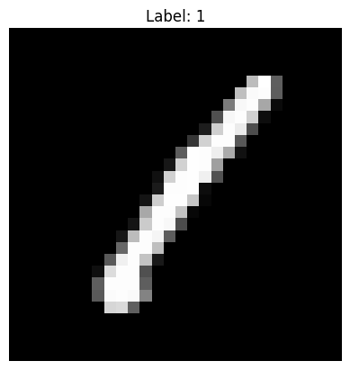

# Digit Recognizer
- MNIST 손글씨 데이터를 분류 인식하는 모델을 만드는 프로젝트 [Link](https://www.kaggle.com/competitions/digit-recognizer/overview)
- 이미지 처리에 특화된 CNN을 사용함

## CNN(Convolutional Neural Network)
이미지의 특정 패턴(객체의 모서리, 선, 질감 등)들을 통해 서로다른 것들을 구분해내는 사람의 시신경 구조를 본떠 만들어짐

### 구성 요소
- **Convolutional Layer**: 이미지에 작은 필터(kerner)을 적용하여 특징을 추출해냄
  - 커널과 같은 크기의 이미지 부분공간의 행렬곱을 통해서 특징(얼마나 닮았는지)을 추출해냄
- **Pooling Layer**: 도출해낸 특징들로 이뤄진 faeture map 크기를 줄여 계산량을 줄이고 모델의 강인함과 불변성을 향상시킴(실습에서는 MaxPooling을 통해 지정된 공간내에서 가장 큰 값으로 대체함)
- **Fully Connected Layer**: 추출한 특징들을 바탕으로 기존 딥러닝 연산을 수행함


```python
# This Python 3 environment comes with many helpful analytics libraries installed
# It is defined by the kaggle/python Docker image: https://github.com/kaggle/docker-python
# For example, here's several helpful packages to load

import numpy as np # linear algebra
import pandas as pd # data processing, CSV file I/O (e.g. pd.read_csv)

# Input data files are available in the read-only "../input/" directory
# For example, running this (by clicking run or pressing Shift+Enter) will list all files under the input directory

import os
for dirname, _, filenames in os.walk('/kaggle/input'):
    for filename in filenames:
        print(os.path.join(dirname, filename))

# You can write up to 20GB to the current directory (/kaggle/working/) that gets preserved as output when you create a version using "Save & Run All" 
# You can also write temporary files to /kaggle/temp/, but they won't be saved outside of the current session
```

    /kaggle/input/digit-recognizer/sample_submission.csv
    /kaggle/input/digit-recognizer/train.csv
    /kaggle/input/digit-recognizer/test.csv
    


```python
import pandas as pd
import matplotlib.pyplot as plt
from tensorflow.keras import layers, models
```

    2025-08-19 09:00:20.179171: E external/local_xla/xla/stream_executor/cuda/cuda_fft.cc:477] Unable to register cuFFT factory: Attempting to register factory for plugin cuFFT when one has already been registered
    WARNING: All log messages before absl::InitializeLog() is called are written to STDERR
    E0000 00:00:1755594020.529854      19 cuda_dnn.cc:8310] Unable to register cuDNN factory: Attempting to register factory for plugin cuDNN when one has already been registered
    E0000 00:00:1755594020.625218      19 cuda_blas.cc:1418] Unable to register cuBLAS factory: Attempting to register factory for plugin cuBLAS when one has already been registered
    


```python
BASE_PATH = "/kaggle/input/digit-recognizer/"

train = pd.read_csv(BASE_PATH + "train.csv")
test = pd.read_csv(BASE_PATH + "test.csv")
```


```python
train.shape
```


    (42000, 785)


```python
train.head() ## 한 행에 이미지의 label과 28x28 이미지의 각 픽셀 값이 저장되어있음
```


<div>
<style scoped>
    .dataframe tbody tr th:only-of-type {
        vertical-align: middle;
    }

    .dataframe tbody tr th {
        vertical-align: top;
    }

    .dataframe thead th {
        text-align: right;
    }
</style>
<table border="1" class="dataframe">
  <thead>
    <tr style="text-align: right;">
      <th></th>
      <th>label</th>
      <th>pixel0</th>
      <th>pixel1</th>
      <th>pixel2</th>
      <th>pixel3</th>
      <th>pixel4</th>
      <th>pixel5</th>
      <th>pixel6</th>
      <th>pixel7</th>
      <th>pixel8</th>
      <th>...</th>
      <th>pixel774</th>
      <th>pixel775</th>
      <th>pixel776</th>
      <th>pixel777</th>
      <th>pixel778</th>
      <th>pixel779</th>
      <th>pixel780</th>
      <th>pixel781</th>
      <th>pixel782</th>
      <th>pixel783</th>
    </tr>
  </thead>
  <tbody>
    <tr>
      <th>0</th>
      <td>1</td>
      <td>0</td>
      <td>0</td>
      <td>0</td>
      <td>0</td>
      <td>0</td>
      <td>0</td>
      <td>0</td>
      <td>0</td>
      <td>0</td>
      <td>...</td>
      <td>0</td>
      <td>0</td>
      <td>0</td>
      <td>0</td>
      <td>0</td>
      <td>0</td>
      <td>0</td>
      <td>0</td>
      <td>0</td>
      <td>0</td>
    </tr>
    <tr>
      <th>1</th>
      <td>0</td>
      <td>0</td>
      <td>0</td>
      <td>0</td>
      <td>0</td>
      <td>0</td>
      <td>0</td>
      <td>0</td>
      <td>0</td>
      <td>0</td>
      <td>...</td>
      <td>0</td>
      <td>0</td>
      <td>0</td>
      <td>0</td>
      <td>0</td>
      <td>0</td>
      <td>0</td>
      <td>0</td>
      <td>0</td>
      <td>0</td>
    </tr>
    <tr>
      <th>2</th>
      <td>1</td>
      <td>0</td>
      <td>0</td>
      <td>0</td>
      <td>0</td>
      <td>0</td>
      <td>0</td>
      <td>0</td>
      <td>0</td>
      <td>0</td>
      <td>...</td>
      <td>0</td>
      <td>0</td>
      <td>0</td>
      <td>0</td>
      <td>0</td>
      <td>0</td>
      <td>0</td>
      <td>0</td>
      <td>0</td>
      <td>0</td>
    </tr>
    <tr>
      <th>3</th>
      <td>4</td>
      <td>0</td>
      <td>0</td>
      <td>0</td>
      <td>0</td>
      <td>0</td>
      <td>0</td>
      <td>0</td>
      <td>0</td>
      <td>0</td>
      <td>...</td>
      <td>0</td>
      <td>0</td>
      <td>0</td>
      <td>0</td>
      <td>0</td>
      <td>0</td>
      <td>0</td>
      <td>0</td>
      <td>0</td>
      <td>0</td>
    </tr>
    <tr>
      <th>4</th>
      <td>0</td>
      <td>0</td>
      <td>0</td>
      <td>0</td>
      <td>0</td>
      <td>0</td>
      <td>0</td>
      <td>0</td>
      <td>0</td>
      <td>0</td>
      <td>...</td>
      <td>0</td>
      <td>0</td>
      <td>0</td>
      <td>0</td>
      <td>0</td>
      <td>0</td>
      <td>0</td>
      <td>0</td>
      <td>0</td>
      <td>0</td>
    </tr>
  </tbody>
</table>
<p>5 rows × 785 columns</p>
</div>


```python
y = train["label"]
X = train.drop(columns="label")
```


```python
label = y[0]
pixels = X.loc[0].values

image = pixels.reshape(28, 28)

plt.imshow(image, cmap='gist_gray')
plt.title(f'Label: {label}')
plt.axis('off')
plt.show()
```


    

    


```python
X = X/255.0 ## 0~255로 이루어진 각 픽셀값들을 0~1로 정규화
X
```


<div>
<style scoped>
    .dataframe tbody tr th:only-of-type {
        vertical-align: middle;
    }

    .dataframe tbody tr th {
        vertical-align: top;
    }

    .dataframe thead th {
        text-align: right;
    }
</style>
<table border="1" class="dataframe">
  <thead>
    <tr style="text-align: right;">
      <th></th>
      <th>pixel0</th>
      <th>pixel1</th>
      <th>pixel2</th>
      <th>pixel3</th>
      <th>pixel4</th>
      <th>pixel5</th>
      <th>pixel6</th>
      <th>pixel7</th>
      <th>pixel8</th>
      <th>pixel9</th>
      <th>...</th>
      <th>pixel774</th>
      <th>pixel775</th>
      <th>pixel776</th>
      <th>pixel777</th>
      <th>pixel778</th>
      <th>pixel779</th>
      <th>pixel780</th>
      <th>pixel781</th>
      <th>pixel782</th>
      <th>pixel783</th>
    </tr>
  </thead>
  <tbody>
    <tr>
      <th>0</th>
      <td>0.0</td>
      <td>0.0</td>
      <td>0.0</td>
      <td>0.0</td>
      <td>0.0</td>
      <td>0.0</td>
      <td>0.0</td>
      <td>0.0</td>
      <td>0.0</td>
      <td>0.0</td>
      <td>...</td>
      <td>0.0</td>
      <td>0.0</td>
      <td>0.0</td>
      <td>0.0</td>
      <td>0.0</td>
      <td>0.0</td>
      <td>0.0</td>
      <td>0.0</td>
      <td>0.0</td>
      <td>0.0</td>
    </tr>
    <tr>
      <th>1</th>
      <td>0.0</td>
      <td>0.0</td>
      <td>0.0</td>
      <td>0.0</td>
      <td>0.0</td>
      <td>0.0</td>
      <td>0.0</td>
      <td>0.0</td>
      <td>0.0</td>
      <td>0.0</td>
      <td>...</td>
      <td>0.0</td>
      <td>0.0</td>
      <td>0.0</td>
      <td>0.0</td>
      <td>0.0</td>
      <td>0.0</td>
      <td>0.0</td>
      <td>0.0</td>
      <td>0.0</td>
      <td>0.0</td>
    </tr>
    <tr>
      <th>2</th>
      <td>0.0</td>
      <td>0.0</td>
      <td>0.0</td>
      <td>0.0</td>
      <td>0.0</td>
      <td>0.0</td>
      <td>0.0</td>
      <td>0.0</td>
      <td>0.0</td>
      <td>0.0</td>
      <td>...</td>
      <td>0.0</td>
      <td>0.0</td>
      <td>0.0</td>
      <td>0.0</td>
      <td>0.0</td>
      <td>0.0</td>
      <td>0.0</td>
      <td>0.0</td>
      <td>0.0</td>
      <td>0.0</td>
    </tr>
    <tr>
      <th>3</th>
      <td>0.0</td>
      <td>0.0</td>
      <td>0.0</td>
      <td>0.0</td>
      <td>0.0</td>
      <td>0.0</td>
      <td>0.0</td>
      <td>0.0</td>
      <td>0.0</td>
      <td>0.0</td>
      <td>...</td>
      <td>0.0</td>
      <td>0.0</td>
      <td>0.0</td>
      <td>0.0</td>
      <td>0.0</td>
      <td>0.0</td>
      <td>0.0</td>
      <td>0.0</td>
      <td>0.0</td>
      <td>0.0</td>
    </tr>
    <tr>
      <th>4</th>
      <td>0.0</td>
      <td>0.0</td>
      <td>0.0</td>
      <td>0.0</td>
      <td>0.0</td>
      <td>0.0</td>
      <td>0.0</td>
      <td>0.0</td>
      <td>0.0</td>
      <td>0.0</td>
      <td>...</td>
      <td>0.0</td>
      <td>0.0</td>
      <td>0.0</td>
      <td>0.0</td>
      <td>0.0</td>
      <td>0.0</td>
      <td>0.0</td>
      <td>0.0</td>
      <td>0.0</td>
      <td>0.0</td>
    </tr>
    <tr>
      <th>...</th>
      <td>...</td>
      <td>...</td>
      <td>...</td>
      <td>...</td>
      <td>...</td>
      <td>...</td>
      <td>...</td>
      <td>...</td>
      <td>...</td>
      <td>...</td>
      <td>...</td>
      <td>...</td>
      <td>...</td>
      <td>...</td>
      <td>...</td>
      <td>...</td>
      <td>...</td>
      <td>...</td>
      <td>...</td>
      <td>...</td>
      <td>...</td>
    </tr>
    <tr>
      <th>41995</th>
      <td>0.0</td>
      <td>0.0</td>
      <td>0.0</td>
      <td>0.0</td>
      <td>0.0</td>
      <td>0.0</td>
      <td>0.0</td>
      <td>0.0</td>
      <td>0.0</td>
      <td>0.0</td>
      <td>...</td>
      <td>0.0</td>
      <td>0.0</td>
      <td>0.0</td>
      <td>0.0</td>
      <td>0.0</td>
      <td>0.0</td>
      <td>0.0</td>
      <td>0.0</td>
      <td>0.0</td>
      <td>0.0</td>
    </tr>
    <tr>
      <th>41996</th>
      <td>0.0</td>
      <td>0.0</td>
      <td>0.0</td>
      <td>0.0</td>
      <td>0.0</td>
      <td>0.0</td>
      <td>0.0</td>
      <td>0.0</td>
      <td>0.0</td>
      <td>0.0</td>
      <td>...</td>
      <td>0.0</td>
      <td>0.0</td>
      <td>0.0</td>
      <td>0.0</td>
      <td>0.0</td>
      <td>0.0</td>
      <td>0.0</td>
      <td>0.0</td>
      <td>0.0</td>
      <td>0.0</td>
    </tr>
    <tr>
      <th>41997</th>
      <td>0.0</td>
      <td>0.0</td>
      <td>0.0</td>
      <td>0.0</td>
      <td>0.0</td>
      <td>0.0</td>
      <td>0.0</td>
      <td>0.0</td>
      <td>0.0</td>
      <td>0.0</td>
      <td>...</td>
      <td>0.0</td>
      <td>0.0</td>
      <td>0.0</td>
      <td>0.0</td>
      <td>0.0</td>
      <td>0.0</td>
      <td>0.0</td>
      <td>0.0</td>
      <td>0.0</td>
      <td>0.0</td>
    </tr>
    <tr>
      <th>41998</th>
      <td>0.0</td>
      <td>0.0</td>
      <td>0.0</td>
      <td>0.0</td>
      <td>0.0</td>
      <td>0.0</td>
      <td>0.0</td>
      <td>0.0</td>
      <td>0.0</td>
      <td>0.0</td>
      <td>...</td>
      <td>0.0</td>
      <td>0.0</td>
      <td>0.0</td>
      <td>0.0</td>
      <td>0.0</td>
      <td>0.0</td>
      <td>0.0</td>
      <td>0.0</td>
      <td>0.0</td>
      <td>0.0</td>
    </tr>
    <tr>
      <th>41999</th>
      <td>0.0</td>
      <td>0.0</td>
      <td>0.0</td>
      <td>0.0</td>
      <td>0.0</td>
      <td>0.0</td>
      <td>0.0</td>
      <td>0.0</td>
      <td>0.0</td>
      <td>0.0</td>
      <td>...</td>
      <td>0.0</td>
      <td>0.0</td>
      <td>0.0</td>
      <td>0.0</td>
      <td>0.0</td>
      <td>0.0</td>
      <td>0.0</td>
      <td>0.0</td>
      <td>0.0</td>
      <td>0.0</td>
    </tr>
  </tbody>
</table>
<p>42000 rows × 784 columns</p>
</div>


```python
X = X.values.reshape(-1, 28, 28, 1) ## CNN을 위해 각 행을 2차원 배열로 재구성
```


```python
model = models.Sequential([
    layers.Conv2D(32, (3, 3), activation='relu', input_shape=(28, 28, 1)), ## 합성곱 계층
    layers.MaxPooling2D((2, 2)), ## 풀링 계층
    layers.Conv2D(64, (3, 3), activation='relu'),
    layers.MaxPooling2D((2, 2)), 
    layers.Flatten(), ## 평탄화
    layers.Dropout(0.5), ## Dropout 모델의 과적합을 방지
    layers.Dense(10, activation='softmax') ## Full Connected 계층
])
```

    /usr/local/lib/python3.11/dist-packages/keras/src/layers/convolutional/base_conv.py:107: UserWarning: Do not pass an `input_shape`/`input_dim` argument to a layer. When using Sequential models, prefer using an `Input(shape)` object as the first layer in the model instead.
      super().__init__(activity_regularizer=activity_regularizer, **kwargs)
    I0000 00:00:1755594043.834784      19 gpu_device.cc:2022] Created device /job:localhost/replica:0/task:0/device:GPU:0 with 13942 MB memory:  -> device: 0, name: Tesla T4, pci bus id: 0000:00:04.0, compute capability: 7.5
    I0000 00:00:1755594043.835467      19 gpu_device.cc:2022] Created device /job:localhost/replica:0/task:0/device:GPU:1 with 13942 MB memory:  -> device: 1, name: Tesla T4, pci bus id: 0000:00:05.0, compute capability: 7.5
    

## Dropout
- 모델의 과적합을 방지하기 위한 규제기법
- 학습 과정에서 신경망의 일부 뉴런을 임의로 끄거나 삭제함
- 신경망은 학습 중에 특정 뉴런이 중요하다고 판단되면, 그 뉴런에 의존해 학습하려고 하는 경향이 있음(**상호동조**) -> **과적합**으로 이어짐
- 이를 방지하기 위해 특정 뉴런이나 경로가 지배적인 역할을 하지 못하도록 강제적으로 조절함으로써 과적합 문제를 완화함.


```python
model.compile(
    optimizer='adam', ## 최적화 함수 Adam
    loss='sparse_categorical_crossentropy', ## 손실함수 Sparse Categorical Crossentropy
    metrics=['accuracy'] ## 평가지표 Accuracy(정확도)
)
```


```python
model.fit(
    X,
    y,
    epochs=3, ## 학습 횟수
    batch_size=32, ## 한 번에 신경망에 입력되어 가중치가 업데이트되는 **데이터샘플의 개수**
    validation_split=0.2 ## 검증 비율
)
```

    Epoch 1/3
    

    WARNING: All log messages before absl::InitializeLog() is called are written to STDERR
    I0000 00:00:1755594047.272390      62 service.cc:148] XLA service 0x7d69800480b0 initialized for platform CUDA (this does not guarantee that XLA will be used). Devices:
    I0000 00:00:1755594047.273755      62 service.cc:156]   StreamExecutor device (0): Tesla T4, Compute Capability 7.5
    I0000 00:00:1755594047.273777      62 service.cc:156]   StreamExecutor device (1): Tesla T4, Compute Capability 7.5
    I0000 00:00:1755594047.552482      62 cuda_dnn.cc:529] Loaded cuDNN version 90300
    

      67/1050 ━━━━━━━━━━━━━━━━━━━━ 2s 2ms/step - accuracy: 0.3616 - loss: 1.9239

    I0000 00:00:1755594050.500399      62 device_compiler.h:188] Compiled cluster using XLA!  This line is logged at most once for the lifetime of the process.
    

    1050/1050 ━━━━━━━━━━━━━━━━━━━━ 9s 4ms/step - accuracy: 0.8147 - loss: 0.5952 - val_accuracy: 0.9714 - val_loss: 0.0887
    Epoch 2/3
    1050/1050 ━━━━━━━━━━━━━━━━━━━━ 3s 3ms/step - accuracy: 0.9644 - loss: 0.1121 - val_accuracy: 0.9826 - val_loss: 0.0566
    Epoch 3/3
    1050/1050 ━━━━━━━━━━━━━━━━━━━━ 3s 3ms/step - accuracy: 0.9744 - loss: 0.0768 - val_accuracy: 0.9845 - val_loss: 0.0470
    


    <keras.src.callbacks.history.History at 0x7d6a845b1510>


```python
test = test/255.0
```


```python
## 채널 설정 유무의 차이점 시각화
X_test = test.values.reshape(-1, 28, 28) 
X_test
```


    array([[[0., 0., 0., ..., 0., 0., 0.],
            [0., 0., 0., ..., 0., 0., 0.],
            [0., 0., 0., ..., 0., 0., 0.],
            ...,
            [0., 0., 0., ..., 0., 0., 0.],
            [0., 0., 0., ..., 0., 0., 0.],
            [0., 0., 0., ..., 0., 0., 0.]],
    
           [[0., 0., 0., ..., 0., 0., 0.],
            [0., 0., 0., ..., 0., 0., 0.],
            [0., 0., 0., ..., 0., 0., 0.],
            ...,
            [0., 0., 0., ..., 0., 0., 0.],
            [0., 0., 0., ..., 0., 0., 0.],
            [0., 0., 0., ..., 0., 0., 0.]],
    
           [[0., 0., 0., ..., 0., 0., 0.],
            [0., 0., 0., ..., 0., 0., 0.],
            [0., 0., 0., ..., 0., 0., 0.],
            ...,
            [0., 0., 0., ..., 0., 0., 0.],
            [0., 0., 0., ..., 0., 0., 0.],
            [0., 0., 0., ..., 0., 0., 0.]],
    
           ...,
    
           [[0., 0., 0., ..., 0., 0., 0.],
            [0., 0., 0., ..., 0., 0., 0.],
            [0., 0., 0., ..., 0., 0., 0.],
            ...,
            [0., 0., 0., ..., 0., 0., 0.],
            [0., 0., 0., ..., 0., 0., 0.],
            [0., 0., 0., ..., 0., 0., 0.]],
    
           [[0., 0., 0., ..., 0., 0., 0.],
            [0., 0., 0., ..., 0., 0., 0.],
            [0., 0., 0., ..., 0., 0., 0.],
            ...,
            [0., 0., 0., ..., 0., 0., 0.],
            [0., 0., 0., ..., 0., 0., 0.],
            [0., 0., 0., ..., 0., 0., 0.]],
    
           [[0., 0., 0., ..., 0., 0., 0.],
            [0., 0., 0., ..., 0., 0., 0.],
            [0., 0., 0., ..., 0., 0., 0.],
            ...,
            [0., 0., 0., ..., 0., 0., 0.],
            [0., 0., 0., ..., 0., 0., 0.],
            [0., 0., 0., ..., 0., 0., 0.]]])


```python
X_test = test.values.reshape(-1, 28, 28, 1) ## test 데이터셋의 각 행을 1채널(흑백 이미지)의 28x28 크기의 배열로 저장함
X_test
```


    array([[[[0.],
             [0.],
             [0.],
             ...,
             [0.],
             [0.],
             [0.]],
    
            [[0.],
             [0.],
             [0.],
             ...,
             [0.],
             [0.],
             [0.]],
    
            [[0.],
             [0.],
             [0.],
             ...,
             [0.],
             [0.],
             [0.]],
    
            ...,
    
            [[0.],
             [0.],
             [0.],
             ...,
             [0.],
             [0.],
             [0.]],
    
            [[0.],
             [0.],
             [0.],
             ...,
             [0.],
             [0.],
             [0.]],
    
            [[0.],
             [0.],
             [0.],
             ...,
             [0.],
             [0.],
             [0.]]],
    
    
           [[[0.],
             [0.],
             [0.],
             ...,
             [0.],
             [0.],
             [0.]],
    
            [[0.],
             [0.],
             [0.],
             ...,
             [0.],
             [0.],
             [0.]],
    
            [[0.],
             [0.],
             [0.],
             ...,
             [0.],
             [0.],
             [0.]],
    
            ...,
    
            [[0.],
             [0.],
             [0.],
             ...,
             [0.],
             [0.],
             [0.]],
    
            [[0.],
             [0.],
             [0.],
             ...,
             [0.],
             [0.],
             [0.]],
    
            [[0.],
             [0.],
             [0.],
             ...,
             [0.],
             [0.],
             [0.]]],
    
    
           [[[0.],
             [0.],
             [0.],
             ...,
             [0.],
             [0.],
             [0.]],
    
            [[0.],
             [0.],
             [0.],
             ...,
             [0.],
             [0.],
             [0.]],
    
            [[0.],
             [0.],
             [0.],
             ...,
             [0.],
             [0.],
             [0.]],
    
            ...,
    
            [[0.],
             [0.],
             [0.],
             ...,
             [0.],
             [0.],
             [0.]],
    
            [[0.],
             [0.],
             [0.],
             ...,
             [0.],
             [0.],
             [0.]],
    
            [[0.],
             [0.],
             [0.],
             ...,
             [0.],
             [0.],
             [0.]]],
    
    
           ...,
    
    
           [[[0.],
             [0.],
             [0.],
             ...,
             [0.],
             [0.],
             [0.]],
    
            [[0.],
             [0.],
             [0.],
             ...,
             [0.],
             [0.],
             [0.]],
    
            [[0.],
             [0.],
             [0.],
             ...,
             [0.],
             [0.],
             [0.]],
    
            ...,
    
            [[0.],
             [0.],
             [0.],
             ...,
             [0.],
             [0.],
             [0.]],
    
            [[0.],
             [0.],
             [0.],
             ...,
             [0.],
             [0.],
             [0.]],
    
            [[0.],
             [0.],
             [0.],
             ...,
             [0.],
             [0.],
             [0.]]],
    
    
           [[[0.],
             [0.],
             [0.],
             ...,
             [0.],
             [0.],
             [0.]],
    
            [[0.],
             [0.],
             [0.],
             ...,
             [0.],
             [0.],
             [0.]],
    
            [[0.],
             [0.],
             [0.],
             ...,
             [0.],
             [0.],
             [0.]],
    
            ...,
    
            [[0.],
             [0.],
             [0.],
             ...,
             [0.],
             [0.],
             [0.]],
    
            [[0.],
             [0.],
             [0.],
             ...,
             [0.],
             [0.],
             [0.]],
    
            [[0.],
             [0.],
             [0.],
             ...,
             [0.],
             [0.],
             [0.]]],
    
    
           [[[0.],
             [0.],
             [0.],
             ...,
             [0.],
             [0.],
             [0.]],
    
            [[0.],
             [0.],
             [0.],
             ...,
             [0.],
             [0.],
             [0.]],
    
            [[0.],
             [0.],
             [0.],
             ...,
             [0.],
             [0.],
             [0.]],
    
            ...,
    
            [[0.],
             [0.],
             [0.],
             ...,
             [0.],
             [0.],
             [0.]],
    
            [[0.],
             [0.],
             [0.],
             ...,
             [0.],
             [0.],
             [0.]],
    
            [[0.],
             [0.],
             [0.],
             ...,
             [0.],
             [0.],
             [0.]]]])


```python
predictions = model.predict(X_test)
```

    875/875 ━━━━━━━━━━━━━━━━━━━━ 1s 1ms/step
    


```python
sample_submissions = pd.read_csv(BASE_PATH+'sample_submission.csv')
```


```python
sample_submissions['Label'] = predictions.argmax(axis=1) ## argmax를 이용해서 가장 확률이 높은 분류값을 최종 레이블로 설정함
```


```python
sample_submissions
```


<div>
<style scoped>
    .dataframe tbody tr th:only-of-type {
        vertical-align: middle;
    }

    .dataframe tbody tr th {
        vertical-align: top;
    }

    .dataframe thead th {
        text-align: right;
    }
</style>
<table border="1" class="dataframe">
  <thead>
    <tr style="text-align: right;">
      <th></th>
      <th>ImageId</th>
      <th>Label</th>
    </tr>
  </thead>
  <tbody>
    <tr>
      <th>0</th>
      <td>1</td>
      <td>2</td>
    </tr>
    <tr>
      <th>1</th>
      <td>2</td>
      <td>0</td>
    </tr>
    <tr>
      <th>2</th>
      <td>3</td>
      <td>9</td>
    </tr>
    <tr>
      <th>3</th>
      <td>4</td>
      <td>9</td>
    </tr>
    <tr>
      <th>4</th>
      <td>5</td>
      <td>3</td>
    </tr>
    <tr>
      <th>...</th>
      <td>...</td>
      <td>...</td>
    </tr>
    <tr>
      <th>27995</th>
      <td>27996</td>
      <td>9</td>
    </tr>
    <tr>
      <th>27996</th>
      <td>27997</td>
      <td>7</td>
    </tr>
    <tr>
      <th>27997</th>
      <td>27998</td>
      <td>3</td>
    </tr>
    <tr>
      <th>27998</th>
      <td>27999</td>
      <td>9</td>
    </tr>
    <tr>
      <th>27999</th>
      <td>28000</td>
      <td>2</td>
    </tr>
  </tbody>
</table>
<p>28000 rows × 2 columns</p>
</div>


```python
sample_submissions.to_csv('submissions.csv', index=False)
```
